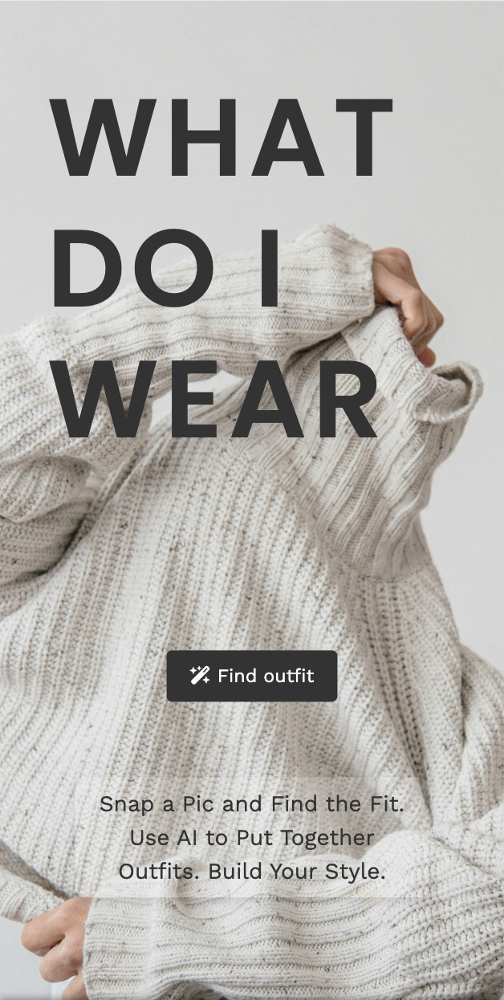

# What-Do-I-Wear App

A stylish, AI-powered app to help you choose the perfect outfit for any occasion. With the *What-Do-I-Wear* app, you can upload your photos, get personalized style advice, and never wonder what to wear again.

---

## Features

- **AI Style Coach**: Get instant style recommendations based on your personal preferences and photos.
- **User Authentication**: Secure login and registration with Devise.
- **Outfit Suggestions**: Receive curated outfits with matching pieces and accessories.
- **Responsive Design**: A smooth, mobile-friendly user experience powered by Bootstrap.

---

## 🛠 Tech Stack

- **Ruby on Rails**: The backbone of the app, providing a full-stack framework for rapid development.
- **PostgreSQL**: Relational database to store user data, outfit preferences, and more.
- **Bootstrap**: Styling framework for responsive, mobile-first design.
- **Stimulus** & **Turbo**: For a modern, fast, and dynamic user experience.
- **Devise**: Authentication and security for user management.
- **Cloudinary**: Image upload and management for photos.
- **Ruby-OpenAI**: Powering AI-based style recommendations.

---

## Setup

To set up the app locally, follow these steps:

git clone https://github.com/your-username/what-do-i-wear.git
cd what-do-i-wear
bundle install
rails db:create db:migrate

_##create an env. file and add your API keys. We used Cloudinary##_

rails server

_##You should now be able to access the app at http://localhost:3000.##_

Features to Come
Outfit Tracker: Prevents you from repeating an outfit add your desired frequency.

Popular Pieces: Shows you how often users across the app choose each piece.

Outfit Sharing: Share your outfits with friends or the community.

Contributing
Feel free to fork the repository and make contributions.
Create an issue for bugs or suggestions, and submit a pull request for new features or fixes!

🛠 Built With
Ruby: v3.3.5

Rails: v7.1.5

PostgreSQL: v13.5

Cloudinary: v1.16.0

FontAwesome: v6.1

Bootstrap: v5.2

Stimulus & Turbo: For dynamic behavior

Rails app generated with [lewagon/rails-templates](https://github.com/lewagon/rails-templates), created by the [Le Wagon coding bootcamp](https://www.lewagon.com) team.
